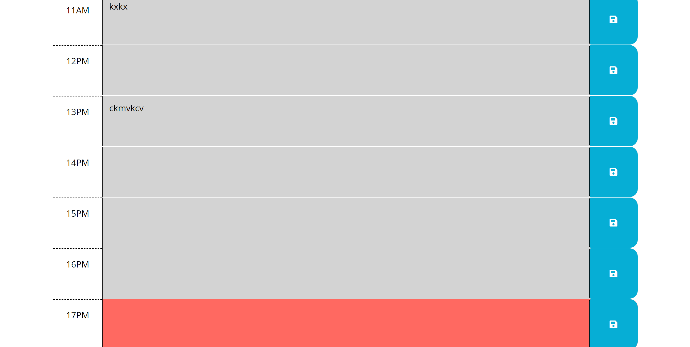

# <Time-organizer>

## Description

Nowadays due to the fast pace of life it is easy to forget our meetings and events, this issue is what motivated me to develop a web app to tackle the issue presented. This project was built with the purpose of creating a tool for people that need to register their daily schedules to live a more organized and active life. This was a great way to further understand the use of apis and familiarize myself with jquery.

## Usage

Provide instructions and examples for use. Include screenshots as needed.

To add a screenshot, create an `assets/images` folder in your repository and upload your screenshot to it. Then, using the relative file path, add it to your README using the following syntax:

